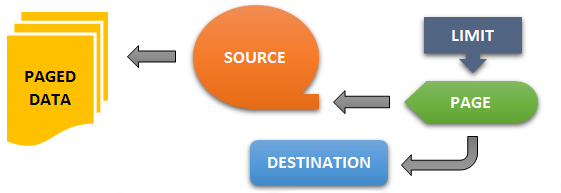

## page(source, [dest], [limit]) ⇒ <code>Promise</code>
**Summary**: Resolves a dynamic sequence of pages/arrays with <a href="https://github.com/vitaly-t/spex/wiki/Mixed-Values">mixed values</a>.  

---
**Alternative Syntax:**
`page(source, {dest, limit})` &#8658; `Promise`

Acquires pages (arrays of <a href="https://github.com/vitaly-t/spex/wiki/Mixed-Values">mixed values</a>) from the source function, one by one,
and resolves each page as a <a href="batch.md">batch</a>, till no more pages left or an error/reject occurs.


### Parameters
<table>
  <thead>
    <tr>
      <th>Param</th><th>Type</th><th>Default</th><th>Description</th>
    </tr>
  </thead>
  <tbody>
<tr>
    <td>source</td><td><code>function</code></td><td></td><td>
Expected to return a <a href="https://github.com/vitaly-t/spex/wiki/Mixed-Values">mixed value</a> that resolves with the next page of data (array of <a href="https://github.com/vitaly-t/spex/wiki/Mixed-Values">mixed values</a>).
Returning or resolving with <code>undefined</code> ends the sequence, and the method resolves.

The function is called with the same <code>this</code> context as the calling method.

Parameters:

<ul>
<li><code>index</code> = index of the page being requested</li>
<li><code>data</code> = previously returned page, resolved as a <a href="batch.md">batch</a> (<code>undefined</code> when <code>index=0</code>)</li>
<li><code>delay</code> = number of milliseconds since the last call (<code>undefined</code> when <code>index=0</code>)</li>
</ul>

If the function throws an error or returns a rejected promise, the method rejects with
object <code>{index, error, source}</code>:

<ul>
<li><code>index</code> = index of the request that failed</li>
<li><code>error</code> = the error thrown or the rejection reason</li>
<li><code>source</code> = resolved <code>data</code> that was passed into the function</li>
</ul>

And if the function returns or resolves with anything other than an array or <code>undefined</code>,
the method rejects with the same object, but with <code>error</code> set to <code>Unexpected data returned
from the source.</code>

Passing in anything other than a function will throw <code>Invalid page source.</code>

</td>
    </tr><tr>
    <td>[dest]</td><td><code>function</code></td><td></td><td>
Optional destination function (notification callback), to receive a resolved <a href="batch.md">batch</a> of data
for each page, process it and respond as required.

Parameters:

<ul>
<li><code>index</code> = page index in the sequence</li>
<li><code>data</code> = page data resolved as a <a href="batch.md">batch</a></li>
<li><code>delay</code> = number of milliseconds since the last call (<code>undefined</code> when <code>index=0</code>)</li>
</ul>

The function is called with the same <code>this</code> context as the calling method.

It can optionally return a promise object, if notifications are handled asynchronously.
And if a promise is returned, the method will not request another page from the <code>source</code>
function until the promise has been resolved.

If the function throws an error or returns a promise that rejects, the sequence terminates,
and the method rejects with object <code>{index, error, dest}</code>:

<ul>
<li><code>index</code> = index of the page passed into the function</li>
<li><code>error</code> = the error thrown or the rejection reason</li>
<li><code>dest</code> = resolved <a href="batch.md">batch</a> that was passed into the function</li>
</ul>

Passing in a non-empty value other than a function will throw <code>Invalid page destination.</code>

</td>
    </tr><tr>
    <td>[limit]</td><td><code>Number</code></td><td><code>0</code></td><td>
Limits the maximum number of pages to be requested from the <code>source</code>. If the value is an
integer greater than 0, the method will successfully resolve once the specified limit has
been reached.

When <code>limit</code> isn&#39;t specified (default), the sequence is unlimited, and it will continue
till one of the following occurs:

<ul>
<li><code>source</code> returns or resolves with <code>undefined</code> or an invalid value (non-array)</li>
<li>either <code>source</code> or <code>dest</code> functions throw an error or return a rejected promise</li>
</ul>
</td>
    </tr>  </tbody>
</table>

**Returns**: <code>Promise</code> - When successful, the method resolves with object `{pages, total, duration}`:
 - `pages` = number of pages resolved
 - `total` = the sum of all page sizes (total number of values resolved)
 - `duration` = number of milliseconds consumed by the method

When the method fails, there are two types of rejects that may occur:
 - *Normal Reject*: when one of the pages failed to resolve as a <a href="batch.md">batch</a>
 - *Internal Reject*: caused by either the `source` or the `dest` functions

*Normal Rejects* are reported with object `{index, data}`:
 - `index` = index of the page rejected by method <a href="batch.md">batch</a>
 - `data` = the rejection data from method <a href="batch.md">batch</a>

*Internal Rejects* are reported with object `{index, error, [source], [dest]}`:
 - `index` = index of the page for which the error/reject occurred
 - `error` = the error thrown or the rejection reason
 - `source` - set when caused by the `source` function (see `source` parameter)
 - `dest` - set when caused by the `dest` function (see `dest` parameter)

Object for both reject types has method `getError()` to simplify access to the error.
For *Normal Rejects* it will return `data.getErrors()[0]` (see method <a href="batch.md">batch</a>),
and `error` value for the *Internal Rejects*.  
