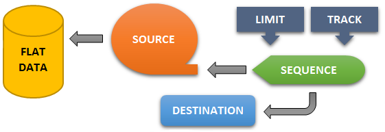

## sequence(source, [dest], [limit], [track]) ⇒ <code>Promise</code>
**Summary**: Resolves a dynamic sequence of <a href="https://github.com/vitaly-t/spex/wiki/Mixed-Values">mixed values</a>.  

---
**Alternative Syntax:**
`sequence(source, {dest, limit, track})` &#8658; `Promise`

Acquires <a href="https://github.com/vitaly-t/spex/wiki/Mixed-Values">mixed values</a> from the source function, one at a time, and resolves them,
till either no more values left in the sequence or an error/reject occurs.
It supports both [linked and detached sequencing](../concept/sequencing.md).


### Parameters
<table>
  <thead>
    <tr>
      <th>Param</th><th>Type</th><th>Default</th><th>Description</th>
    </tr>
  </thead>
  <tbody>
<tr>
    <td>source</td><td><code>function</code></td><td></td><td>
Expected to return the next <a href="https://github.com/vitaly-t/spex/wiki/Mixed-Values">mixed value</a> to be resolved. Returning or resolving
with <code>undefined</code> ends the sequence, and the method resolves.

Parameters:

<ul>
<li><code>index</code> = current request index in the sequence</li>
<li><code>data</code> = resolved data from the previous call (<code>undefined</code> when <code>index=0</code>)</li>
<li><code>delay</code> = number of milliseconds since the last call (<code>undefined</code> when <code>index=0</code>)</li>
</ul>

The function is called with the same <code>this</code> context as the calling method.

If the function throws an error or returns a rejected promise, the sequence terminates,
and the method rejects with object <code>{index, error, source}</code>:

<ul>
<li><code>index</code> = index of the request that failed</li>
<li><code>error</code> = the error thrown or the rejection reason</li>
<li><code>source</code> = resolved <code>data</code> that was passed into the function</li>
</ul>

Passing in anything other than a function will throw <code>Invalid sequence source.</code>

</td>
    </tr><tr>
    <td>[dest]</td><td><code>function</code></td><td></td><td>
Optional destination function (notification callback), to receive resolved data for each index,
process it and respond as required.

Parameters:

<ul>
<li><code>index</code> = index of the resolved data in the sequence</li>
<li><code>data</code> = the data resolved</li>
<li><code>delay</code> = number of milliseconds since the last call (<code>undefined</code> when <code>index=0</code>)</li>
</ul>

The function is called with the same <code>this</code> context as the calling method.

It can optionally return a promise object, if data processing is done asynchronously.
If a promise is returned, the method will not request another value from the <code>source</code> function,
until the promise has been resolved.

If the function throws an error or returns a rejected promise, the sequence terminates,
and the method rejects with object <code>{index, error, dest}</code>:

<ul>
<li><code>index</code> = index of the data that was processed</li>
<li><code>error</code> = the error thrown or the rejection reason</li>
<li><code>dest</code> = resolved data that was passed into the function</li>
</ul>

Passing in a non-empty value other than a function will throw <code>Invalid sequence destination.</code>

</td>
    </tr><tr>
    <td>[limit]</td><td><code>Number</code></td><td><code>0</code></td><td>
Limits the maximum size of the sequence. If the value is greater than 0, the method will
successfully resolve once the specified limit has been reached.

When <code>limit</code> isn&#39;t specified (default), the sequence is unlimited, and it will continue
till one of the following occurs:

<ul>
<li><code>source</code> either returns or resolves with <code>undefined</code></li>
<li>either <code>source</code> or <code>dest</code> functions throw an error or return a rejected promise</li>
</ul>
</td>
    </tr><tr>
    <td>[track]</td><td><code>Boolean</code></td><td><code>false</code></td><td>
Changes the type of data to be resolved by this method. By default, it is <code>false</code>
(see the return result). When set to be <code>true</code>, the method tracks/collects all resolved data
into an array internally, and resolves with that array once the method has finished successfully.

It must be used with caution, as to the size of the sequence, because accumulating data for
a very large sequence can result in consuming too much memory.

</td>
    </tr>  </tbody>
</table>

**Returns**: <code>Promise</code> - When successful, the resolved data depends on parameter `track`. When `track` is `false`
(default), the method resolves with object `{total, duration}`:
 - `total` = number of values resolved by the sequence
 - `duration` = number of milliseconds consumed by the method

When `track` is `true`, the method resolves with an array of all the data that has been resolved,
the same way that the standard `promise.all` resolves. In addition, the array comes extended with
read-only property `duration` - number of milliseconds consumed by the method.

When the method fails, the reject result depends on which function caused the failure - `source`
or `dest`. See the two parameters for the rejection details.  
